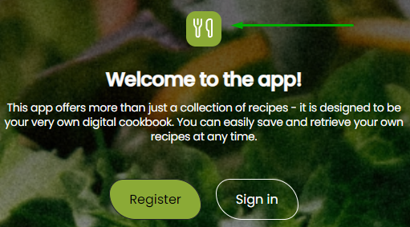
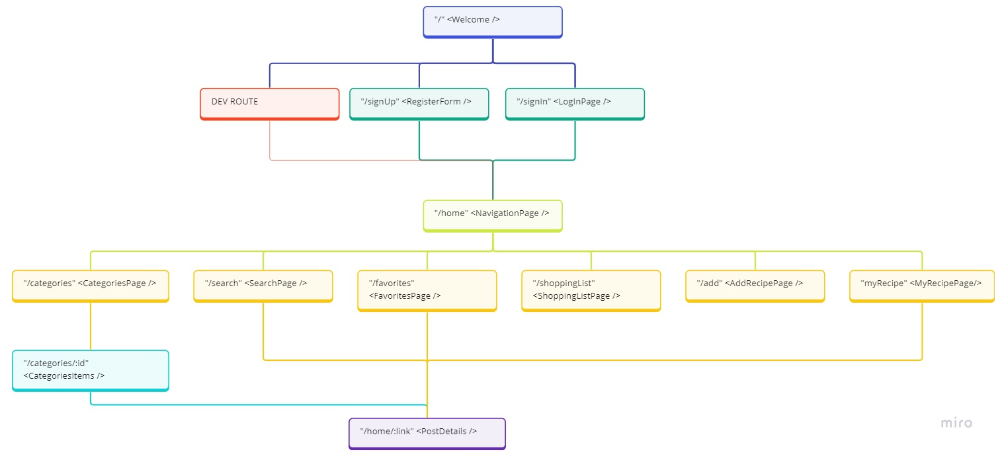

# App Project

An App with collection of recipes where user can easily search for interesting recipe, save favorite one, create shopping list and save his own recipe.

> Live demo [_here_](https://so-yummy-app.netlify.app/)

## Dev info

You can enter the "/home" route simply by clicking the fork icon on the welcome page without login/registration or simply [_click_here_](https://so-yummy-app.netlify.app/home).

### Ready to use:

-   Dark/light theme
-   Categories
-   Recipes details
-   Search for new recipes
-   Add to shopping list

### In progress:

-   Favorite one - next to do!
-   Add recipes
-   My recipes

## APP Route map

## Project dependencies

-   react
-   react-redux
-   react-router
-   redux toolkit
-   styled-components
-   fontawesome
-   axios
-   nanoid

### Recipe API:

> [_Edamam recipe API_](https://www.edamam.com/)
